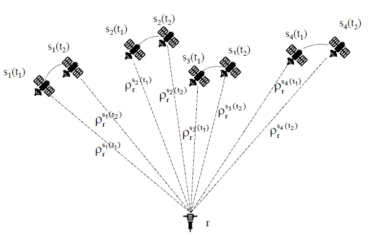

<h1  align=center>GNSS Data Processing with RINEX Observation Data</h1>

<small>Picture Source: <a href="https://www.hytera.com/iwov-resources/hytera/02_products/4_banner_image/">hytera</a>

<h2>Project Description</h2>

Within this repository, you can find the tasks of **GNSS Data Processing** course given by **Prof. Dr. Sławomir Cellmer**. You can find the process and mathematical equations for the data processing with explanations in .pdf files in the ***PDF's*** folder. From there, you can have an idea about the course content and learn how the studies are done step by step. The aim of the course is, using mathematical formulas and filtering GNSS data where we get from [BKG](https://igs.bkg.bund.de/) website. Studies were conducted on **6 different exercises**. The .txt files were given to us by the Professor.

<h2>Presentations</h2>

<h3>RINEX The Receiver Independent Exchange Format</h3>

Different manufacturers of GPS receivers had their own format of data file. During large GPS observation campain different GPS receivers have been involved.
Hence, a need for one common format of data file arised.

Until now three major versions have been developed and published:

<ul>
	<li><i>Version 1 (1989)</i></li>
	<li><i>Version 2 (1990)</i></li>
	<li><i>Version 3 (2015)</i></li>
</ul>

There are some RINEX-like exchange file formats, mainly used by the International GNSS service IGS e.g.:

<ul>
	<li><i>IONEX</i> – exchange format for ionosphere models</li>
	<li><i>ANTEX</i> – exchange format for phase center variations of geodetic GNSS antennae</li>
</ul>

<h4> Version 3.XX</h4>

Three <i>ASCII</i> file types:

<ul>
	<li>Observation data file</li>
	<li>Navigation data file</li>
	<li>Meteorological data file</li>
</ul>

<h4>Observation Data File</h4>

There are three quantities in that file:

 1. <b><i>Time</i></b> is receiver time of the received signals. 	

	 - Identical for the phase and pseudorange measurement.  	
	 - Identical for  all satellites observed at that epoch

2.	<b><i>Pseudo-Range (PR)</i></b> is the distance from the receiver antenna to the satellite antenna including receiver and satellite clock offsets (and other biases, such as atmospheric delays:

	$c=2.997 \cdot 10^{8} \dfrac{m}{s}$
	
	$PR = distance + c * (receiver \ clock \ offset \ – \ satellite \ clock \ offset) + other \ biases$

3.	<b><i>Phase</i></b> is the carrier phase measured in whole cycles.

<h4>Satellite Numbers</h4>

Starting with RINEX Version 2 the satellite numbers are preceded by a one-character system identifier. Satellite system identifier:

Satellite system identifier:

<ul>
	<li><i>G: GPS</i></li>
	<li><i>R: GLONASS</i></li>
	<li><i>S: SBAS</i></li>
	<li><i>E: Galileo</i></li>
	<li><i>C: BeiDou</i></li>
	<li><i>J: QZSS</i></li>
	<li><i>I: IRNSS</i></li>
</ul>

More about topic: 

 - [RINEX The Receiver Independent Exchange Format (rinex.pdf)](https://github.com/doguilmak/GNSS-Data-Processing-with-RINEX-Observation-Data/blob/main/PDF%27s/rinex1.pdf)
 - [RINEX Observation Data File: Data record (rinex2.pdf)](https://github.com/doguilmak/GNSS-Data-Processing-with-RINEX-Observation-Data/blob/main/PDF%27s/rinex2.pdf)
 - [RINEX The Receiver Independent Exchange Format - IGS / RTCM-SC104 (rinex304.pdf)](https://github.com/doguilmak/GNSS-Data-Processing-with-RINEX-Observation-Data/blob/main/PDF%27s/rinex304.pdf)

<h3> Equations of the Code Observation<h3>

<h4>Mathematical Model of the Code Observation</h4>

$$P_{r}^{s} = (t_r - t^s) \cdot c  = \rho_{r}^{s} + (dt_r - dt^s) + dT_{r}^{s} + dI_{r}^{s} + \epsilon_p$$

$P_{r}^{s} =$  Code observation

$t_r =$  Signal reception time

$t^s =$  Signal emission time

$c =$  Speed of light

$\rho_{r}^{s} =$  Distance between thesatellites at 
epoch $t^s$ and receiver at epoch $t_r$

$dt_r =$  Receicer clock bias

$dt^s =$  Satellite clock bias

$dT_{r}^{s} =$  Tropospheric correction

$dI_{r}^{s} =$  Ionospheric correction

$\epsilon_p =$  Unmodelled error

<h4> Observation Equation of the Code Observation</h4>

$$P_{r}^{s} - dT_{r}^{s} - dI_{r}^{s} + v_P = \rho_{r}^{s} + cdt_r$$

$dT_{r}^{s}$ and $dI_{r}^{s}$ calculated in another computational process e.g. from iono-and trophospheric models.

$V_p = - \epsilon_p$ 

<h4>Linear Form of the Observation Equation</h4>

$$P_{r}^{s} - dT_{r}^{s} - dI_{r}^{s} + v_P = \dfrac{\partial\rho_{r}^{s}}{\partial x^0} dx + \dfrac{\partial\rho_{r}^{s}}{\partial y^0} dy +\dfrac{\partial\rho_{r}^{s}}{\partial z^0} dz + \rho^0 + cdt_r$$

<h4>Linear Form of the Residual Equation</h4>

$$V^s = \dfrac{\partial\rho_{r}^{s}}{\partial x^0} dx + \dfrac{\partial\rho_{r}^{s}}{\partial y^0} dy +\dfrac{\partial\rho_{r}^{s}}{\partial z^0} dz + cdt_r - (P_{r}^{s} - dT_{r}^{s} - dI_{r}^{s} - \rho^0)$$

<h4> System of the Residual Equations</h4>

$$ V^{s1} = \dfrac{\partial\rho_{r}^{s1}}{\partial x^0} dx + \dfrac{\partial\rho_{r}^{s1}}{\partial y^0} dy +\dfrac{\partial\rho_{r}^{s1}}{\partial z^0} dz + cdt_r - (P_{r}^{s1} - dT_{r}^{s1} - dI_{r}^{s1} - \rho^{0s1}) $$ 

$$ V^{s2} = \dfrac{\partial\rho_{r}^{s2}}{\partial x^0} dx + \dfrac{\partial\rho_{r}^{s2}}{\partial y^0} dy +\dfrac{\partial\rho_{r}^{s2}}{\partial z^0} dz + cdt_r - (P_{r}^{s2} - dT_{r}^{s2} - dI_{r}^{s2} - \rho^{0s2}) $$

$$ \vdots $$ 

$$V^{sn} = \dfrac{\partial\rho_{r}^{sn}}{\partial x^0} dx + \dfrac{\partial\rho_{r}^{sn}}{\partial y^0} dy +\dfrac{\partial\rho_{r}^{sn}}{\partial z^0} dz + cdt_r - (P_{r}^{sn} - dT_{r}^{sn} - dI_{r}^{sn} - \rho^{0sn})$$

 

$$\rho_{r}^{s} = \sqrt{(x^s - x_r)^2+(y^s - y_r)^2+(z^s - z_r)^2}$$

 

<h5>Matrix Form of the System of the Residual Equations</h5>

$$V = AX-L$$

 

$$V = \begin{bmatrix}  
v^{s1} \\  
v^{s1} \\ 
\vdots \\
v^{sn}
\end{bmatrix}$$

 

$$A = \begin{bmatrix}  
\dfrac{x_r - x^{s1}}{\rho^{0s1}_r} & \dfrac{y_r - y^{s1}}{\rho^{0s1}_r} & \dfrac{z_r - z^{s1}}{\rho^{0s1}_r} & 1 \\  
\dfrac{x_r - x^{s2}}{\rho^{0s2}_r} & \dfrac{y_r - y^{s2}}{\rho^{0s2}_r} & \dfrac{z_r - z^{s2}}{\rho^{0s2}_r} & 1 \\
\vdots & \vdots & \vdots & \vdots \\
\dfrac{x_r - x^{sn}}{\rho^{0sn}_r} & \dfrac{y_r - y^{sn}}{\rho^{0sn}_r} & \dfrac{z_r - z^{sn}}{\rho^{0sn}_r} & 1   
\end{bmatrix}$$

 

$$P = \begin{bmatrix}  
m^{-2}_{P^{s1}_r} & & \\  
 & m^{-2}_{P^{s2}_r} & &\\ 
 &  & \ddots & \\ 
 & & & m^{-2}_{P^{sn}_r}
\end{bmatrix}$$

 

$$X = \begin{bmatrix}  
dx_r \\  
dy_r \\ 
dz_r \\
cdt_r
\end{bmatrix}$$

 

$$L= \begin{bmatrix}  
(P_{r}^{s1} - dT_{r}^{s1} - dI_{r}^{s1} - \rho^{0s1}) \\  
(P_{r}^{s2} - dT_{r}^{s2} - dI_{r}^{s2} - \rho^{0s2}) \\ 
\vdots \\
(P_{r}^{sn} - dT_{r}^{sn} - dI_{r}^{sn} - \rho^{0sn})
\end{bmatrix}$$

More about topic: 

 - [Mathematical Model of the Code Observation (SPP1.pdf)](https://github.com/doguilmak/GNSS-Data-Processing-with-RINEX-Observation-Data/blob/main/PDF's/SPP1.pdf)

<h4>Multi-epoch (number of epochs: k)</h4>

$$A^TPAX-A^TPL = 0$$

$$X=(A^TPA)^{-1} \ A^TPL$$

 

$$A = \begin{bmatrix}  
A_{x1} & \underset{nx1}{1} &  &  \\  
A_{x2} &  & \underset{nx1}{1}  &  \\
\vdots &  &  & \ddots \\
A_{x1} &  &  &  & \underset{nx1}{1}   
\end{bmatrix}$$

 

$$X = \begin{bmatrix}  
dx_r \\  
dy_r \\ 
dz_r \\
cdt_r \\
\vdots \\
cdt_{rk}
\end{bmatrix}$$

 

$$P = \begin{bmatrix}  
P_1 & & \\  
 & P_2 & &\\ 
 &  & \ddots & \\ 
 & & & P_k
\end{bmatrix}$$

 

$$L = \begin{bmatrix}  
L_1 \\  
L_2 \\ 
\vdots \\
L_k
\end{bmatrix}$$

 

<h5> Accuracy Analysis</h5>

$$A^TPAX-A^TPL=0$$
$$X=(A^TPA)^{-1} \ A^TPL$$

Parameter covariance matrix:

$$m_{0}^{2} = \dfrac{V^TPV}{n-m}$$

$$C_x = m_{0}^{2}(A^TPA)^{-1}$$

$$C_x = \begin{bmatrix}  
C_{rp} & C_{12} \\  
C_{21} & C_{dt} 
\end{bmatrix}$$

 

Squared mean errors of position coordinates:

$$C_{rp} = \begin{bmatrix}  
m_{x}^2 & m_{xy} & m_{xz} \\  
m_{yx} & m_{y}^2 & m_{yz} \\
m_{zx} & m_{zy} & m_{z}^2  
\end{bmatrix}$$

$$
C_{dt}=\left[
\begin{array}{ccc}
   m_{dt1}^2 & \cdots & m_{dt1k} \\
   \vdots & \ddots & \vdots \\
   m_{dtk1} & \cdots & m_{dtk}^2
\end{array}
\right]
$$

More about topic: 

 - [Multi-epoch (SPP-multi-epoch.pdf)](https://github.com/doguilmak/GNSS-Data-Processing-with-RINEX-Observation-Data/blob/main/PDF's/SPP-multi-epoch.pdf)
 - [Adjustment (adjust-general.pdf)](https://github.com/doguilmak/GNSS-Data-Processing-with-RINEX-Observation-Data/blob/main/PDF%27s/adjust-general.pdf)

## Contact Me

If you have something to say to me please contact me: 

 - Twitter: [Doguilmak](https://twitter.com/Doguilmak)  
 - Mail address: doguilmak@gmail.com
